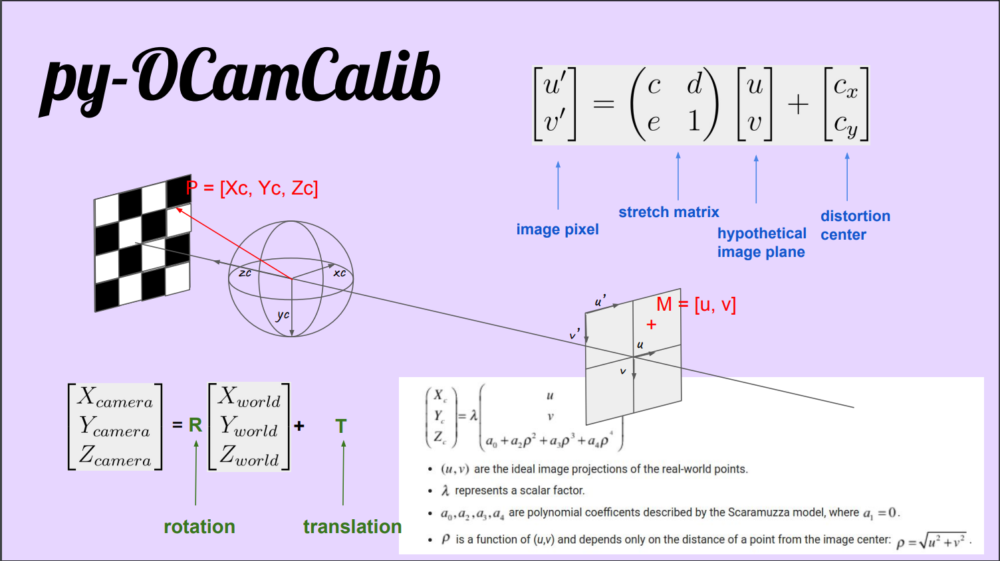

<p align="center">
  
</p>

Py-OCamCalib is a pure Python/Numpy implementation of <a href="https://rpg.ifi.uzh.ch/people_scaramuzza.html">Scaramuzzas</a> <a href="https://sites.google.com/site/scarabotix/ocamcalib-omnidirectional-camera-calibration-toolbox-for-matlab">OcamCalib</a> Toolbox.

Repo forked from https://github.com/jakarto3d/py-OCamCalib.

## Usage
Modify the `config.yaml` file.

```bash
docker compose up --build
```

Calibration output can be found in the `src/pyocamcalib/checkpoints/calibration` folder.